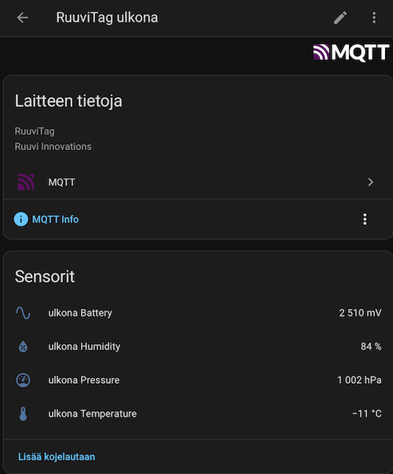

# RuuviTag → MQTT (Home Assistant)

This project listens to RuuviTag BLE advertisements and publishes sensor readings to MQTT.
It also publishes Home Assistant MQTT Discovery configs automatically, so sensors appear in Home Assistant without manual configuration.

<p align="left">


</p>

## Features

- Reads RuuviTag BLE advertisements (BlueZ)
- Publishes readings to MQTT
- Home Assistant MQTT Discovery (temperature / humidity / pressure / battery)

## Requirements

- Linux host with Bluetooth 
- Docker + Docker Compose
- Mosquitto / MQTT broker (Home Assistant add-on or standalone)

## Setup

Create a `docker-compose.yml` file. The `privileged`, `network_mode`, and `volumes` settings are required for Bluetooth access. See the <a href="#environment-variables">environment variables</a> section for configuration options.

```yaml
services:
  ruuvi_mqtt:
    image: artop/ruuvitag-mqtt:latest
    container_name: ruuvi_mqtt
    restart: unless-stopped
    privileged: true
    network_mode: host
    volumes:
      - /var/run/dbus:/var/run/dbus
    environment:
      MQTT_HOST: "192.168.68.1"
      MQTT_PORT: "1883"
      MQTT_USER: "mqttuser"
      MQTT_PASS: "mqttpass"
```

Pull the image

```bash
docker compose pull
```

Run the scanner to list nearby RuuviTag devices:

```bash
docker compose run --rm ruuvi_mqtt python -m app.scan
```

Create a JSON mapping of devices (`mac-address: friendly name`):

```json
{"A1:B2:C3:D4:E5:F6":"outside","A7:B8:C9:DD:EE:FF":"livingroom"}
```

Add the devices to the `docker-compose.yml` environment variables:

```yaml
services:
  ruuvi_mqtt:
    # ...
    environment:
      RUUVI_TAGS: '{"A1:B2:C3:D4:E5:F6":"outside","A7:B8:C9:DD:EE:FF":"livingroom"}'
    # ...
```

Start the container

```bash
docker compose up -d
```

The entities will be added to Home Assistant automatically if [MQTT Discovery](https://www.home-assistant.io/integrations/mqtt/#mqtt-discovery) is enabled.

<p>

</p>

## Environment Variables

| Setting | Description | Default value
|--------|---------|----------|
| `RUUVI_TAGS` | JSON mapping of RuuviTag devices: `{"MAC":"friendly_name"}`. Used for selecting which tags to listen to and for naming topics and Home Assistant entities. **Required** |  |
| `PUBLISH_MIN_INTERVAL` | Minimum publish interval (seconds) per tag. Limits how often sensor updates are sent to MQTT (reduces spam). | `15` |
| `MQTT_HOST` | MQTT broker hostname or IP address. | `localhost` |
| `MQTT_PORT` | MQTT broker port. | `1883` |
| `MQTT_USER` | MQTT username (if broker requires authentication). |  |
| `MQTT_PASS` | MQTT password (if broker requires authentication). |  |
| `MQTT_PREFIX` | Base MQTT topic prefix for all published topics. | `ruuvi` |
| `MQTT_RETAIN` | If `true`, published sensor JSON values are retained by the broker (latest value stored). | `false` |
| `MQTT_QOS` | MQTT QoS level for sensor JSON publishing (`0`, `1`, or `2`). | `0` |
| `HA_DISCOVERY_PREFIX` | Home Assistant MQTT discovery prefix. Home Assistant listens on this prefix for auto-discovery configs. | `homeassistant` |
| `AVAIL_ONLINE` | Payload sent to availability topics when the publisher/tag is online. | `online` |
| `AVAIL_OFFLINE` | Payload sent to availability topics when the publisher/tag is offline. | `offline` |
| `TZ` | Timezone for log messages (eg. `Europe/Helsinki`) | `Etc/UTC` |